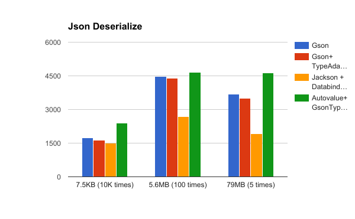

# Json Parsing Performance

## Result

## What tested

I got some json from [json-generator](http://www.json-generator.com/).

There are 3 files : 7KB, 5.6MB, 79MB.

and do unit test.

## Performance

1. Jackson + Databind
2. Gson + TypeAdapter (generated by [Stag-Java](https://github.com/vimeo/stag-java))
3. Gson
4. Auto Value + TypeAdapter (generated by [Auto Value Gson](https://github.com/rharter/auto-value-gson))

I know it's so interesting.

If I did a wrong way to test, Let me know it.